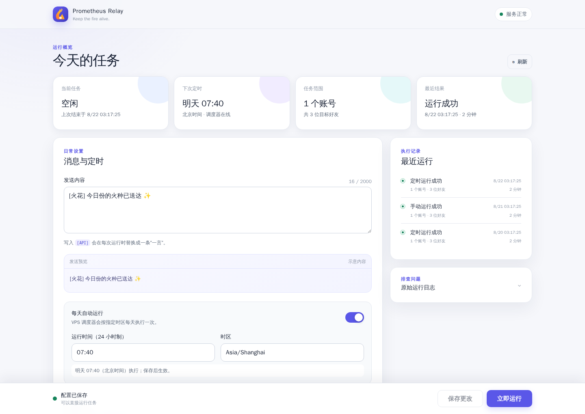
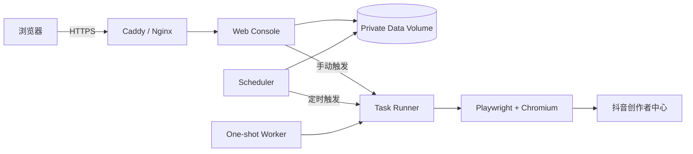

<p align="center">
  
</p>

<p align="center">
  <strong>Keep the fire alive.</strong><br>
  面向个人自托管场景的抖音火花自动维护控制台
</p>

<p align="center">
  <a href="https://github.com/MinG-98/prometheus-relay/actions/workflows/ci.yml"></a>
  <a href="https://github.com/MinG-98/prometheus-relay/blob/main/LICENSE"></a>
  
  
  
  
</p>

<p align="center">
  <a href="#overview">项目概览</a> ·
  <a href="#features">功能亮点</a> ·
  <a href="#architecture">运行架构</a> ·
  <a href="#quick-start">快速部署</a> ·
  <a href="#documentation">文档</a> ·
  <a href="#security">安全</a>
</p>

---

<a id="overview"></a>

## 项目概览

Prometheus Relay 使用 **Playwright + Chromium** 驱动抖音创作者中心，通过接近正常人工操作的方式向指定好友发送续火花消息。项目提供完整的 VPS 网页控制台，让扫码登录、账号、目标好友、消息模板、运行计划和执行记录都能在一个页面中完成管理。

它适合希望把任务放在自己的服务器上长期运行，同时又不想手动维护环境变量、Cron 和浏览器脚本的个人用户。

<p align="center">
  
  <br>
  <sub>真实控制台界面 · 截图使用脱敏模拟数据</sub>
</p>

> [!NOTE]
> Prometheus Relay 是独立维护的开源项目，与抖音及其关联公司不存在隶属、授权或商业合作关系。

<a id="features"></a>

## 功能亮点

| 模块 | 能力 |
| --- | --- |
| 扫码登录 | VPS 生成抖音登录二维码；支持手机确认后的短信二次验证，并自动抓取 Cookie、识别昵称和抖音号 |
| 账号管理 | 支持多账号、多目标好友；重复扫码会刷新 Cookie 并保留已有目标好友 |
| Cookie 备用 | 扫码不可用时仍可上传 Cookie-Editor JSON；已保存内容不会在网页回显 |
| 自动执行 | 支持手动运行、每日定时、IANA 时区和失败重试；文件锁避免任务并发 |
| 好友匹配 | 默认按抖音号精确匹配，也可在必要时切换为原始昵称匹配 |
| 消息内容 | 支持固定模板和 `[API]` 一言占位符，可选择内容分类 |
| 可观测性 | 提供服务状态、下次运行、任务范围、最近结果、历史记录与原始日志 |
| 自托管安全 | 默认仅监听本机地址，支持 Basic Auth、非 Root 容器与私有持久化卷 |
| 部署维护 | 提供 Docker Compose、systemd、健康检查、原子配置写入与私有持久化卷 |

<a id="architecture"></a>

## 运行架构



| Compose 服务 | 职责 | 运行方式 |
| --- | --- | --- |
| `web` | 网页控制台、配置管理、手动触发 | 常驻 |
| `scheduler` | 读取网页计划并在指定时区触发任务 | 常驻 |
| `worker` | 执行一次独立任务，适合 systemd 或命令行调用 | 按需 |

所有服务共享同一私有数据卷。扫码二维码和短信验证码仅在登录会话期间短暂存在于 Web 进程内存中；Cookie 不会写入 Docker 镜像，网页接口也不会返回已保存的 Cookie 内容。

<a id="quick-start"></a>

## 快速部署

### 环境要求

- Linux VPS
- Docker Engine 与 Docker Compose v2
- Caddy、Nginx 或其他可提供 HTTPS 的反向代理
- VPS 网络可以访问抖音创作者中心

### 1. 获取项目

```bash
git clone https://github.com/MinG-98/prometheus-relay.git
cd prometheus-relay
```

### 2. 配置控制台登录

```bash
sudo mkdir -p /etc/prometheus-relay
sudo install -m 600 .env.web.example /etc/prometheus-relay/web.env
sudo editor /etc/prometheus-relay/web.env
```

请至少修改 `ADMIN_USERNAME` 和 `ADMIN_PASSWORD`，并为不同服务使用独立的长密码。

### 3. 启动服务

```bash
PROMETHEUS_RELAY_ENV_FILE=/etc/prometheus-relay/web.env \
  docker compose up -d --build web scheduler
```

控制台默认只监听 `127.0.0.1:18081`。完成 HTTPS 反向代理后，再从浏览器访问对应域名。

### 4. 完成首次任务

1. 在控制台点击“扫码添加”，等待 VPS 生成登录二维码。
2. 使用抖音 App 扫码并在手机上确认登录。
3. 如果抖音要求短信安全验证，等待页面选择短信方式并显示验证码输入框；将短信验证码填入网页后点击“提交验证码”。
4. 验证成功后，账号会自动保存；检查显示的抖音号和昵称是否为本次登录的账号。
5. 打开刚添加的账号，逐行填写目标好友抖音号并保存配置。
6. 先手动运行一次并检查日志。
7. 验证消息发送正常后，再启用每日自动运行。

验证码只会在本次登录会话中短暂存在，不会写入配置或日志。扫码不可用时，可以使用账号编辑区中的 Cookie JSON 上传作为备用方式。

> [!TIP]
> 生产环境推荐使用仓库提供的 systemd 单元托管服务。完整命令、更新、备份和 Caddy 示例见 [Docker 网页部署说明](docs/docker-deployment.md)。

<a id="documentation"></a>

## 文档

| 文档 | 适用场景 |
| --- | --- |
| [Docker 网页部署](docs/docker-deployment.md) | VPS 长期运行、systemd 托管、更新和备份 |
| [配置说明](docs/配置生成器使用.md) | 扫码、短信验证、手动 Cookie 备用方式与目标好友 |
| [源代码部署](docs/源代码部署说明.md) | 本地开发、任务面板或无 Docker 环境 |
| [安全策略](SECURITY.md) | 凭证保护与漏洞报告 |
| [来源说明](NOTICE) | 上游项目、版权与主要改造内容 |

<details>
<summary><strong>本地开发</strong></summary>

```bash
python -m venv .venv
source .venv/bin/activate
python -m pip install -r requirements.txt
python -m unittest discover -s tests -v
```

启动开发服务器：

```bash
AUTH_ENABLED=false PROMETHEUS_RELAY_DATA_DIR=./data \
  uvicorn webapp.main:app --reload
```

提交前还可以验证 Compose 配置：

```bash
PROMETHEUS_RELAY_ENV_FILE=.env.web.example docker compose config --quiet
```

</details>

<details>
<summary><strong>项目结构</strong></summary>

```text
core/       Playwright 浏览器自动化与消息构建
webapp/     FastAPI 控制台、配置存储、调度器与任务执行器
deploy/     systemd 服务单元
docs/       部署、配置和使用文档
tests/      配置与运行状态测试
```

</details>

<a id="security"></a>

## 安全

> [!WARNING]
> Cookie 等同于账号登录凭证。不要将 Cookie、真实配置、运行日志或数据卷备份提交到 Git，也不要粘贴到 Issue、截图或聊天记录中。

- 保持 `AUTH_ENABLED=true`，并使用 HTTPS 和独立强密码。
- 不要直接向公网开放 `18081` 端口。
- 将 `/etc/prometheus-relay/web.env` 权限保持为 `600`。
- 备份数据卷后，应按敏感凭证文件进行保存和销毁。
- 活跃二维码同样属于短时登录凭证，不要截图或转发给其他人。
- Cookie 一旦泄露，应立即退出相关登录会话并重新登录。

漏洞请通过 GitHub 仓库的私密安全报告入口提交，且只能使用脱敏测试数据。更多信息见 [SECURITY.md](SECURITY.md)。

## 参与项目

欢迎通过 [Issues](https://github.com/MinG-98/prometheus-relay/issues) 报告经过脱敏的问题，或在 [Discussions](https://github.com/MinG-98/prometheus-relay/discussions) 中提出功能建议。提交 Pull Request 前，请确保测试全部通过。

## 来源与许可

Prometheus Relay 派生自 [2061360308/DouYinSparkFlow](https://github.com/2061360308/DouYinSparkFlow)，并在 MIT 许可下独立维护。当前项目新增了自托管网页控制台、扫码自动抓取 Cookie、账号管理、每日调度、运行历史、Docker/systemd 部署与安全加固。

原作者及当前维护者版权均保留在 [LICENSE](LICENSE) 中，完整来源说明见 [NOTICE](NOTICE)。

## 使用边界

本项目仅用于技术研究和个人自用，不得用于批量骚扰、恶意刷量或规避平台限制。自动化操作可能触发平台风控；使用者应遵守抖音服务协议及所在地法律，并自行承担账号限制、封禁或数据丢失等风险。建议仅配置少量真实好友，并采用合理的每日运行频率。
